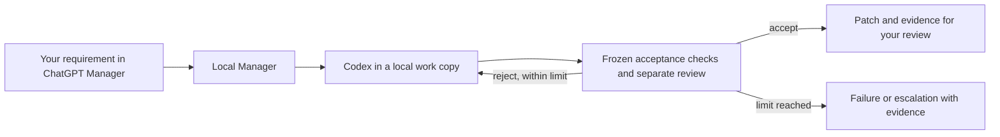

# Codex Manager — Windows private beta

**Give ChatGPT the task. Let it manage Codex until tests pass.**

A local-first manager for one bounded repo task: describe the requirement in ChatGPT Manager, let Codex implement it in a local work copy, and get a patch with acceptance-check and review evidence. Failed checks trigger bounded repairs. The beta stops after its configured limit; the headline is a goal, not a guarantee.

**Free private beta: 0.1.0-beta · Windows x64 · one task at a time · up to three iterations.**

[Apply for a free repo trial](mailto:yipengyou72@gmail.com?subject=Codex%20Manager%20Windows%20Beta) · [Installation and eligibility](docs/INSTALL.md) · [Privacy](docs/PRIVACY.md)

## The actual repair loop

In an internal Desktop end-to-end run on October 5, 2026:

1. A single natural-language request asked for a duration-parser implementation.
2. Codex's first attempt passed lint, typecheck and build, but passed only **30/31 tests**.
3. Manager rejected that attempt and requested a repair for leading/trailing ASCII spaces.
4. Codex repaired the implementation. The second attempt passed **31/31 tests**, with lint/typecheck/build also passing and a separate review accepting the result.
5. The result was a patch. The original repo remained unchanged.

[Sanitized result](demo/recorded-result.json) · [45-second recording script](demo/RECORDING-SCRIPT.md) · [Evidence scope](docs/EVIDENCE.md)

This 31-test example was recorded on Stage 5.1 before External Beta packaging. The beta's separate installation demo passed **16/16** in one iteration. These are internal checks, not external customer trials, and neither proves general reliability or time saved. No demo video has been recorded for this public page yet.

## How it fits

The coding agent's completion message is a claim. The Manager runs the registered checks outside the coding step and uses their results to decide what happens next. A green test suite still only verifies what those tests cover.

## Try it on one real task

Email **yipengyou72@gmail.com** with:

- Your Windows version and whether your Desktop Work host supports **local stdio MCP and plugins**.
- Whether Codex CLI is already signed in and has model quota.
- One small repo task and the checks that would prove it is done.

Do not email your repo, credentials or private source. We first check setup, then send the private ZIP, checksum and installation notes. Run the bundled demo, then explicitly authorize a low-risk repo and allowed files. The trial is free; your existing model access is separate. No payment signup is required.

## Local-first, with a clear privacy boundary

Repo copies, patches and local records stay on your machine. Required source context, instructions and check output are sent to the model service through your signed-in Codex account. This is **local execution, not offline AI**. Local checks execute project code; a work copy is not an operating-system sandbox. You decide what scope to authorize and what non-sensitive feedback to share.

## Known limits

- Windows-only beta. Windows 11 has been tested; Windows 10, fresh Windows users/VMs, fresh model accounts and reboot/cold start are unverified.
- Requires PowerShell 5.1, Node.js >=22.18, Git for Windows, signed-in Codex CLI and a Desktop Work host supporting local MCP/plugins. Ordinary web/mobile ChatGPT and desktop hosts without these capabilities cannot run this package.
- The tested Store host is OpenAI.Codex 26.930.4958.0, with a ChatGPT.exe UI process. Eligibility depends on host capabilities, not the product name alone.
- Unsigned scripts. Dependency setup, login and OS prompts may require manual action.
- One active task; up to three total implementation iterations. Escalation is a valid outcome.
- A narrow set of registered project checks; complex monorepos and Docker runners have not been verified.
- Development and separate review can use the same model. Review is not an independent human audit.
- No automatic patch application to the original repo, merge, push, deployment or payment handling.
- No measured external-user installation rate, time savings or willingness to pay yet.

## Cursor, Devin and Factory

Those tools already offer agent workflows and verification features. We have no head-to-head benchmark and make no superiority claim.

| Tool | Its documented focus | What this beta adds or limits |
|---|---|---|
| [Cursor](https://cursor.com/docs) | Coding, planning, debugging, review and workflow integrations | A specific ChatGPT-to-Codex handoff with registered checks and bounded repairs. This beta is not an editor or Cursor integration. |
| [Devin](https://docs.devin.ai/essential-guidelines/when-to-use-devin) | Delegated engineering tasks in a configured development environment | Our measured scope is one authorized local Windows repo copy and a returned patch; no hosted task fleet or automatic deployment. |
| [Factory Droid](https://docs.factory.com/droid-cli/overview) | A coding agent available through its CLI and connected workflows | This beta manages Codex only; it is not a multi-provider agent platform. |

A developer who already has reliable hooks, CI and review automation may get little additional value. That is what the real-repo trial should measure.

## What is public here

Documentation, a sanitized recorded outcome, architecture and a demo recording plan. The Manager implementation, private beta runtime and commercial source are not open-sourced by this repository. Codex Manager is an independent beta and is not an official OpenAI product.
